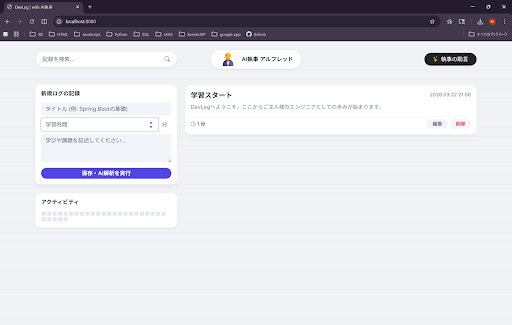
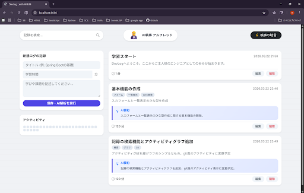
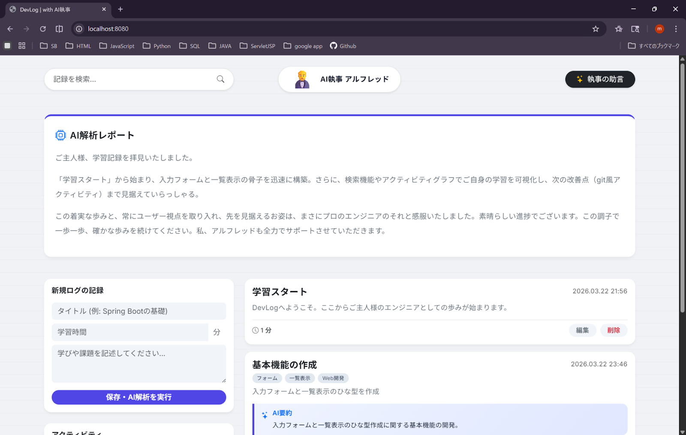

# **DevLog**

### **📖 アプリケーションの概要**

日々のプログラミング学習の軌跡を記録する学習ログアプリケーションです。単なる記録にとどまらず、外部API（Gemini）と連携したサポート機能も備えています。

### **✨ 主な機能**

・学習内容の投稿、編集、および管理機能  
・AI（Gemini）APIを活用した学習サポート機能：投稿を解析し蓄積した学習内容から生成した、少し長めの学習方向などのアドバイスを作ってくれます。

### **🛠 使用技術**

・バックエンド：**Java (Spring Boot)**  
・フロントエンド：**HTML (Thymeleaf), CSS**  
・ビルドツール：**Maven**  
・開発環境：**IntelliJ IDEA**  
・その他：**Git/GitHub, Jacksonライブラリ**

### **💡 開発の目的と背景**

エンジニアへの転職という目標に向け、職業訓練校などで日々蓄積していく知識を可視化するためです。また、実践的なWebアプリケーション開発のフローを、設計から実装まで自らの手で一通り経験し、技術を確実に定着させることを目的としています。  
訓練校での授業内容を復習、予習したりしたログを残し、AI解析で学習方向のアドバイスを生成してもらおうと個人用に進めており、ある程度形になったのでポートフォリオにすることにしました。AIの名前は「執事」で初めに思いついたバットマンの執事が由来です。

### **🧗 苦労した点と工夫した点**

・**フロントエンドとバックエンドの連携**：Thymeleafを用いたView層の構築において、タグの記述エラーによる起動障害に直面しました。また、学習記録投稿時に404エラー（Whitelabel Error Page）が発生しましたが、HTMLフォームのPOST先URLとController側のマッピングの不一致を特定し、データの受け渡しを正確に行うよう修正しました。訓練校で習ったJAVAの分散型の作り方を意識してみました。  
・**環境構築と外部ライブラリの導入**：Windows環境での\`JAVA\_HOME\`未定義によるMaven実行エラーや、IntelliJのプロジェクト構造設定（JDKバージョンと開発言語レベルの不一致）など、環境起因のトラブルを一つずつ解消しました。また、\`GeminiService\`実装時にJacksonライブラリの依存関係やMavenキャッシュの問題に直面しましたが、pom.xmlの整理と再構築によって解決しました。  
・**テストの実施**：JUnitを用いたテストにおいて、ライブラリの配置やコンストラクタでの変数代入ミスを洗い出し、より堅牢なコードを目指して修正を重ねました。

### **スクリーンショット**
・**ダッシュボード画面** 

・**記録更新画** 

・**AI解析アドバイス画面** 

